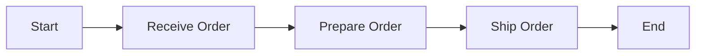
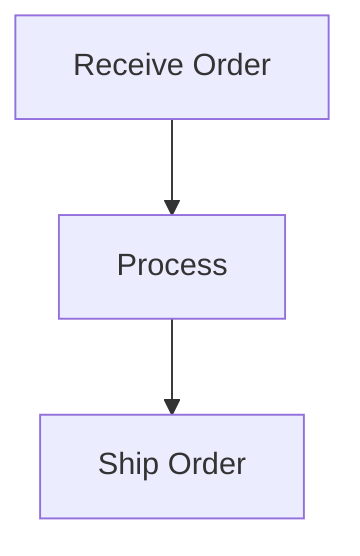

# CodeTrain Skill

## Agentic Coding with CodeTrain: Humans Design, Agents Code!

> If you are an AI agent involved in building LLM Systems with CodeTrain, read this guide **VERY, VERY** carefully! This is the most important document for CodeTrain development. Throughout development, you should always (1) start with a small and simple solution, (2) design at a high level (`docs/design.md`) before implementation, and (3) frequently ask humans for feedback and clarification.

## CodeTrain Philosophy

CodeTrain is **PocketFlow for the African hustle culture** - a minimalist workflow framework that uses logistics-inspired terminology:

- **Job**: Individual unit of work (receive_order → prepare_order → ship_order)
- **Hustle**: Orchestrates multiple Jobs into a workflow  
- **Manifest**: Shared data store passed between Jobs

> "The best framework is the one that gets out of your way and lets you focus on solving business problems, not wrestling with complex abstractions." - Inspired by PocketFlow

## Agentic Coding Steps

Agentic Coding should be a collaboration between Human System Design and Agent Implementation:

| Steps | Human | AI | Comment |
|:------|:-----:|:--:|:--------|
| 1. Requirements | ★★★ High | ★☆☆ Low | Humans understand the requirements and context. |
| 2. Hustle Design | ★★☆ Medium | ★★☆ Medium | Humans specify high-level design, AI fills in details. |
| 3. Utilities | ★★☆ Medium | ★★☆ Medium | Humans provide external APIs, AI helps implement. |
| 4. Manifest Design | ★☆☆ Low | ★★★ High | AI designs data schema, humans verify. |
| 5. Job Design | ★☆☆ Low | ★★★ High | AI helps design Jobs based on the hustle. |
| 6. Implementation | ★☆☆ Low | ★★★ High | AI implements the hustle based on design. |
| 7. Optimization | ★★☆ Medium | ★★☆ Medium | Humans evaluate, AI helps optimize. |
| 8. Reliability | ★☆☆ Low | ★★★ High | AI writes tests and addresses corner cases. |

### 1. Requirements

Clarify the requirements for your project, and evaluate whether an AI system is a good fit.

- **Good for**: Routine tasks requiring common sense (filling forms, replying to emails, processing orders)
- **Good for**: Creative tasks with well-defined inputs (building reports, analyzing data)
- **Not good for**: Ambiguous problems requiring complex decision-making (business strategy, startup planning)

**Keep It User-Centric:** Explain the "problem" from the user's perspective rather than just listing features.

**Balance complexity vs. impact**: Aim to deliver the highest value features with minimal complexity early.

### 2. Hustle Design

Outline at a high level how your AI system orchestrates Jobs.

- Identify applicable design patterns (Map Reduce, Agent, RAG, Workflow).
  - For each Job, start with a high-level one-line description.
  - If using **Map Reduce**, specify how to map (what to split) and how to reduce (how to combine).
  - If using **Agent**, specify inputs (context) and possible actions.
  - If using **RAG**, specify what to embed (offline indexing vs online retrieval).
- Outline the hustle and draw it in a mermaid diagram:



> **If Humans can't specify the hustle, AI Agents can't automate it!** Before building, thoroughly understand the problem by manually solving example inputs to develop intuition.

### 3. Utilities

Identify and implement necessary utility functions.

Think of your AI system as the brain. It needs a body—these *external utility functions*—to interact with the real world:

- Reading inputs (retrieving messages, reading files, querying APIs)
- Writing outputs (generating reports, sending notifications)
- Using external tools (calling LLMs via OpenRouter, searching the web)

**CRITICAL: OpenRouter Configuration**

All LLM calls MUST use the CodeTrain config system:

```python
# codetrain/config.py loads from .env automatically
from codetrain.config import OPENROUTER_API_KEY, OPENROUTER_MODEL
from codetrain.call_llm import call_llm, call_llm_simple

# Use the built-in call_llm functions
def analyze_text(text):
    return call_llm_simple(f"Analyze this: {text}")
```

**Never hardcode API keys!** Always use `codetrain.config` which loads from `.env`:

```bash
# .env file
OPENROUTER_API_KEY=sk-or-v1-your-key-here
OPENROUTER_MODEL=anthropic/claude-3.5-sonnet
```

Utility function template:
```python
# utils/call_llm.py
from codetrain import call_llm_simple

def call_llm(prompt):
    """Call LLM via OpenRouter using CodeTrain's config."""
    return call_llm_simple(prompt)

if __name__ == "__main__":
    # Test the utility
    print(call_llm("Say hello!"))
```

### 4. Manifest Design

Design the shared store that Jobs will use to communicate.

One core principle is to use a well-designed **manifest**—a data contract that all Jobs agree upon:

- For simple systems, use an in-memory dictionary.
- For complex systems, use a database.
- **Don't Repeat Yourself**: Use references or foreign keys.

Example manifest design:
```python
manifest = {
    "order": {
        "id": "ORD-123",
        "customer": "Ama Mensah",
        "items": [],
    },
    "results": {},  # To store outputs
    "config": {...}
}
```

### 5. Job Design

Plan how each Job will read and write data.

For each Job, describe:
- **type**: Regular, Batch, or Async
- **receive_order**: Read from manifest
- **prepare_order**: Call utility functions (use call_llm from codetrain)
- **ship_order**: Write to manifest and return action

Example Job design:
```python
class AnalyzeOrder(ct.Job):
    """Analyze order and determine next step."""
    
    def receive_order(self, manifest):
        # Read from manifest
        return manifest["order"]["items"]
    
    def prepare_order(self, items):
        # Call LLM via CodeTrain's OpenRouter integration
        from codetrain import call_llm_simple
        return call_llm_simple(f"Categorize these items: {items}")
    
    def ship_order(self, manifest, items, category):
        # Write to manifest
        manifest["order"]["category"] = category
        return "default"  # Next action
```

### 6. Implementation

Implement the initial Jobs and hustles based on the design.

- **"Keep it simple, stupid!"** Avoid complex features.
- **FAIL FAST**! Use the built-in retry mechanism.
- Add logging throughout for debugging.

Implementation template:
```python
# jobs.py
import codetrain as ct
from codetrain import call_llm_simple

class MyJob(ct.Job):
    def receive_order(self, manifest):
        return manifest.get("input")
    
    def prepare_order(self, data):
        return call_llm_simple(f"Process: {data}")
    
    def ship_order(self, manifest, data, result):
        manifest["output"] = result
        return "done"

# hustle.py
import codetrain as ct
from jobs import MyJob

def create_hustle():
    job = MyJob()
    return ct.Hustle(start=job)

# main.py
from hustle import create_hustle

def main():
    manifest = {"input": "Hello"}
    hustle = create_hustle()
    hustle.run(manifest)
    print(f"Result: {manifest['output']}")

if __name__ == "__main__":
    main()
```

### 7. Optimization

- **Use Intuition**: Human intuition is a good start for evaluation.
- **Redesign Hustle**: Consider breaking tasks further or better managing contexts.
- **Micro-optimizations**:
  - **Prompt Engineering**: Use clear, specific instructions with examples.
  - **In-Context Learning**: Provide robust examples for difficult tasks.

> **You'll likely iterate a lot!** Expect to repeat Steps 3–6 many times.

### 8. Reliability

- **Job Retries**: Add checks and increase `max_retries` and `wait` times.
- **Logging**: Maintain logs of all attempts.
- **Self-Evaluation**: Add a separate Job to review outputs when uncertain.

## Example CodeTrain Project Structure

```
my_codetrain_project/
├── main.py
├── jobs.py
├── hustle.py
├── utils/
│   ├── __init__.py
│   └── call_llm.py          # Uses codetrain.call_llm
├── .env                      # API keys (never commit!)
├── requirements.txt
└── docs/
    └── design.md
```

### Key Files

**`requirements.txt`**:
```
codetrain
```

**`.env`** (add to .gitignore!):
```
OPENROUTER_API_KEY=sk-or-v1-your-key-here
OPENROUTER_MODEL=anthropic/claude-3.5-sonnet
```

**`docs/design.md`**:
~~~markdown
# Design Doc: Your Project Name

## Requirements

Brief description of what the system should do.

## Hustle Design

### Pattern: [Workflow/Agent/Map Reduce/RAG]

### Flow:
1. **ReceiveOrder Job**: Get input from user/API
2. **ProcessJob**: Analyze/process using LLM
3. **ShipOrder Job**: Deliver results



## Utilities

1. **Call LLM** (`utils/call_llm.py`)
   - Uses: `codetrain.call_llm_simple`
   - Purpose: All LLM calls via OpenRouter

## Manifest Design

```python
manifest = {
    "input": {},
    "results": {}
}
```

## Job Design

1. ReceiveOrderJob
   - prep: Read input
   - exec: Validate
   - post: Store in manifest

2. ProcessJob
   - prep: Read from manifest
   - exec: call_llm_simple()
   - post: Store results
~~~

**`utils/call_llm.py`**:
```python
from codetrain import call_llm_simple

def call_llm(prompt):
    """Call LLM via OpenRouter using CodeTrain's built-in config."""
    return call_llm_simple(prompt)

if __name__ == "__main__":
    print(call_llm("Test connection"))
```

**`jobs.py`**:
```python
import codetrain as ct
from codetrain import call_llm_simple

class ReceiveJob(ct.Job):
    def receive_order(self, manifest):
        return manifest.get("query")
    
    def prepare_order(self, query):
        return query.strip()
    
    def ship_order(self, manifest, query, cleaned):
        manifest["cleaned_query"] = cleaned
        return "default"

class ProcessJob(ct.Job):
    def receive_order(self, manifest):
        return manifest["cleaned_query"]
    
    def prepare_order(self, query):
        # Uses OpenRouter via config.py
        return call_llm_simple(f"Answer: {query}")
    
    def ship_order(self, manifest, query, answer):
        manifest["answer"] = answer
        return "done"
```

**`hustle.py`**:
```python
import codetrain as ct
from jobs import ReceiveJob, ProcessJob

def create_hustle():
    receive = ReceiveJob()
    process = ProcessJob()
    
    # Connect Jobs
    receive >> process
    
    return ct.Hustle(start=receive)
```

**`main.py`**:
```python
from hustle import create_hustle

def main():
    manifest = {"query": "What is CodeTrain?"}
    hustle = create_hustle()
    hustle.run(manifest)
    print(f"Answer: {manifest['answer']}")

if __name__ == "__main__":
    main()
```

## Core Abstractions

### Job

A **Job** is the smallest building block with 3 steps:

1. **`receive_order(manifest)`**: Read and preprocess data from manifest
2. **`prepare_order(order_data)`**: Execute compute logic (LLM calls, processing)
3. **`ship_order(manifest, order_data, result)`**: Postprocess and write back to manifest

```python
class MyJob(ct.Job):
    def receive_order(self, manifest):
        return manifest["data"]
    
    def prepare_order(self, data):
        return call_llm_simple(f"Process: {data}")
    
    def ship_order(self, manifest, data, result):
        manifest["result"] = result
        return "default"
```

### Hustle

A **Hustle** orchestrates Jobs:

```python
job_a >> job_b  # Sequential
job_a - "action" >> job_b  # Conditional

hustle = ct.Hustle(start=job_a)
hustle.run(manifest)
```

### Manifest

The **Manifest** is the shared data store:

```python
manifest = {
    "input": "...",
    "intermediate": "...",
    "output": "..."
}
```

### BatchJob

**BatchJob** handles multiple items:

```python
class ProcessFiles(ct.BatchJob):
    def receive_order(self, manifest):
        return manifest["files"]  # List of files
    
    def prepare_order(self, file):
        return process_single(file)
    
    def ship_order(self, manifest, files, results):
        manifest["processed"] = results
        return "default"
```

## Design Patterns

### Workflow

Chain Jobs in sequence:
```python
load >> process >> save
```

### Agent

Dynamic decision-making:
```python
decide - "search" >> search
decide - "answer" >> answer
search >> decide  # Loop back
```

### Map Reduce

Process in parallel, then combine:
```python
map_job >> reduce_job
```

### RAG

Two-stage retrieval:
```python
# Offline: chunk >> embed >> store
# Online: query_embed >> retrieve >> generate
```

## Using with OpenRouter

CodeTrain uses OpenRouter for LLM access. Configuration is handled automatically via `config.py`:

```python
# In your .env file
OPENROUTER_API_KEY=sk-or-v1-your-key-here
OPENROUTER_MODEL=anthropic/claude-3.5-sonnet
```

```python
# In your code
from codetrain import call_llm_simple

response = call_llm_simple("Your prompt here")
```

**Never hardcode API keys!** Always use the config system.

## Best Practices

1. **Start Simple**: Begin with a basic workflow, then add complexity.
2. **Use the Manifest**: Keep data in manifest, not in Jobs.
3. **One Job, One Task**: Each Job should do one thing well.
4. **Handle Errors**: Use Job's built-in retry mechanism.
5. **Log Everything**: Add logging for debugging.
6. **Test Utilities**: Each utility should have a `main()` test.
7. **Design First**: Write `docs/design.md` before coding.

## Common Mistakes

❌ **Hardcoding API keys**  
✅ Use `codetrain.config` which loads from `.env`

❌ **Putting business logic in utilities**  
✅ Utilities are for external interactions only

❌ **Not using the manifest**  
✅ Pass data through manifest, not as Job params

❌ **Over-engineering**  
✅ Keep it simple - 3 methods per Job is enough

## Resources

- **CodeTrain GitHub**: https://github.com/Speedykom/CodeTrain
- **PocketFlow GitHub**: https://github.com/The-Pocket/PocketFlow
- **OpenRouter**: https://openrouter.ai/

Remember: **CodeTrain = PocketFlow philosophy + African hustle culture + OpenRouter integration**

Keep it simple. Keep it flowing. 🚂
